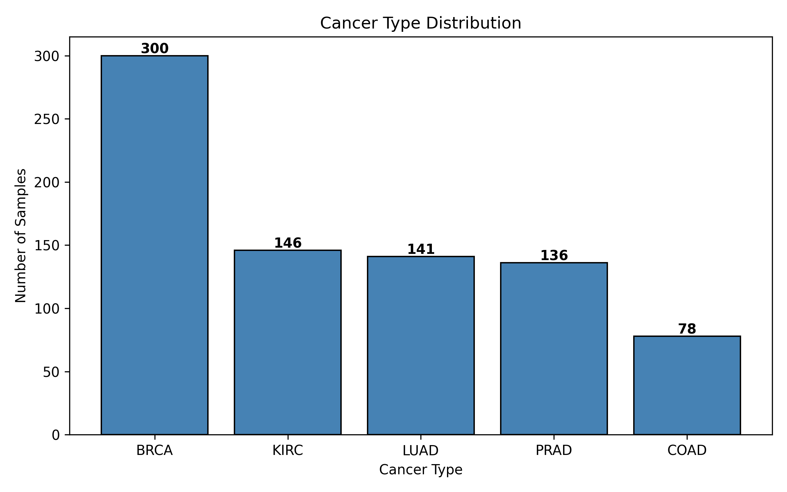
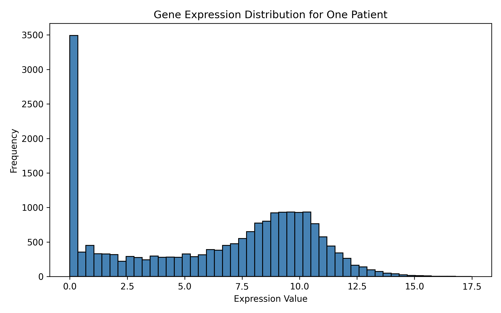
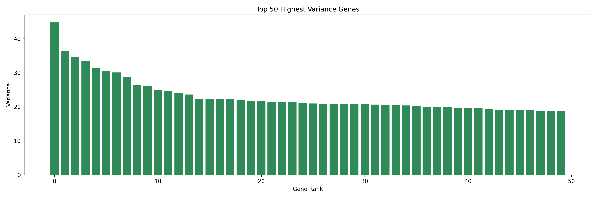
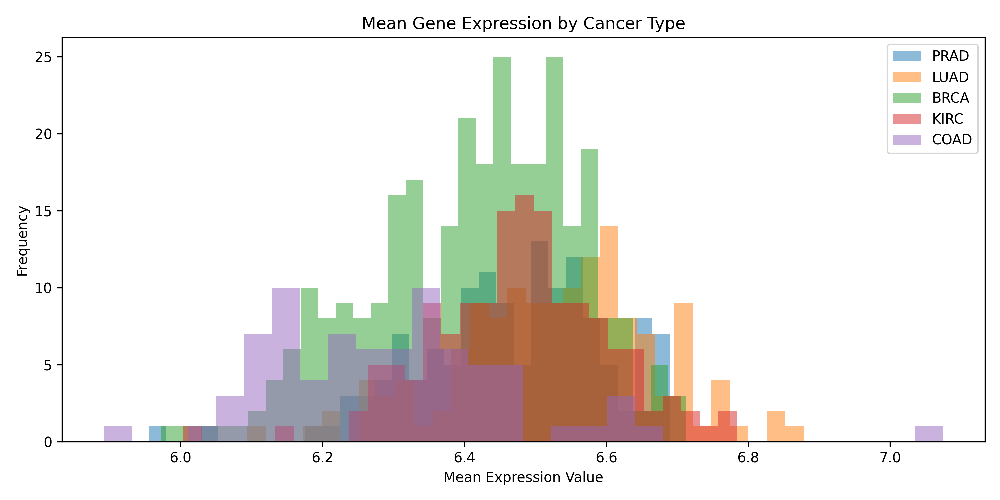
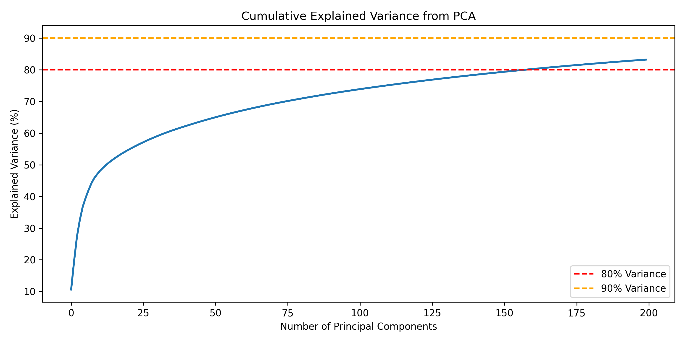
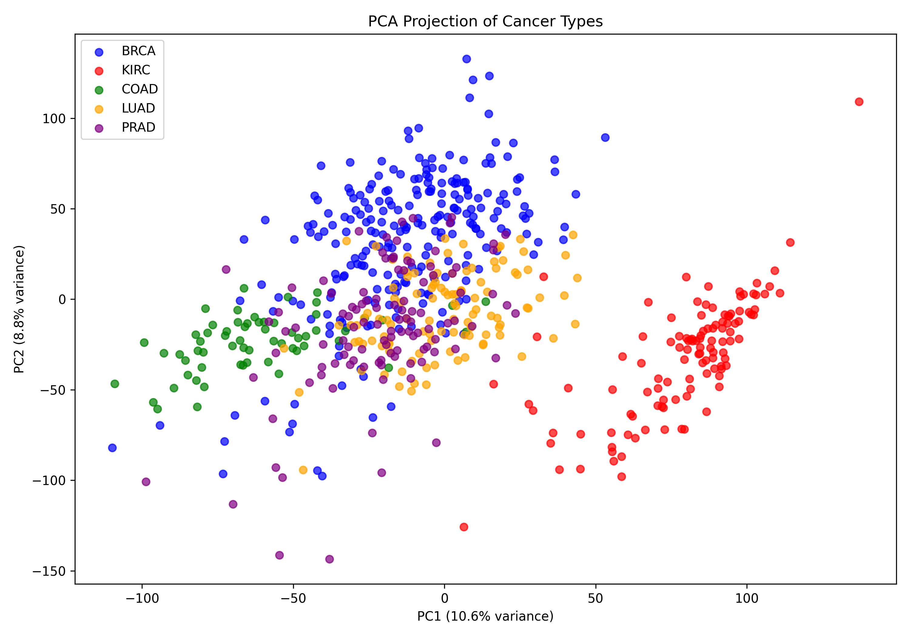
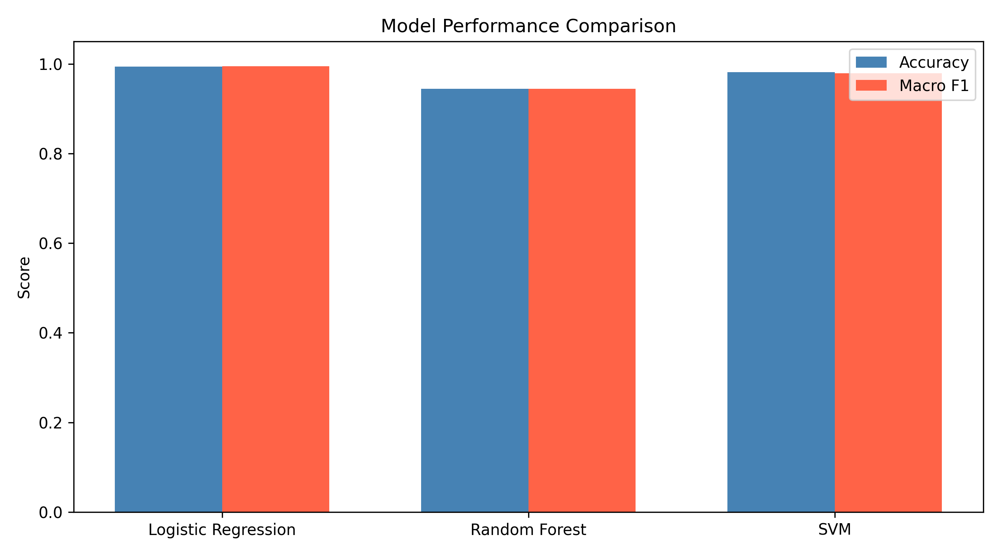
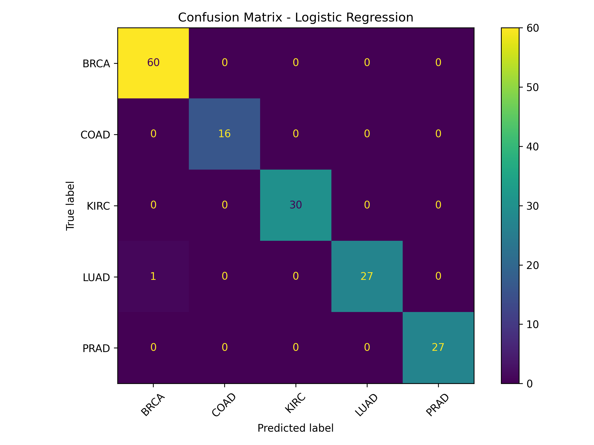

# Cancer Type Classification from Gene Expression Data

## Overview
This project classifies cancer types from RNA-Seq gene expression data using
machine learning. Using the TCGA dataset containing 801 patient tumour samples
across 5 cancer types and 20,531 genes, Logistic Regression achieves 99.38%
accuracy and 99.47% Macro F1 after PCA dimensionality reduction, with perfect
cross-validation scores across all 5 folds.

## Biological Motivation
Traditional cancer diagnosis relies on histopathology, examining tissue under a
microscope. This approach has two critical limitations.

First, metastatic tumours often appear far from their origin site. A tumour found
in the liver may have originated from the colon, lung, or breast. Treatment is
determined by origin, not location, so misidentification leads to ineffective
protocols.

Second, cancers originating in the same tissue can have completely different
molecular profiles. Breast cancer has at least four distinct molecular subtypes
that look identical under a microscope but respond differently to treatment. A
patient with Triple Negative breast cancer does not respond to hormone therapy at
all, yet standard histopathology cannot reliably distinguish this subtype.

Gene expression classification addresses both problems. It identifies the tissue
of origin for metastatic tumours and distinguishes molecular subtypes that
histology misses. This project demonstrates that machine learning on RNA-Seq data
can separate five cancer types with near-perfect accuracy using gene expression
patterns alone.

## Dataset
**Source**: TCGA RNA-Seq Gene Expression dataset via Kaggle
**Samples**: 801 patient tumour samples
**Features**: 20,531 gene expression values per sample
**Target**: 5 cancer types

| Cancer Type | Full Name | Samples |
|---|---|---|
| BRCA | Breast Invasive Carcinoma | 300 |
| KIRC | Kidney Renal Clear Cell Carcinoma | 146 |
| LUAD | Lung Adenocarcinoma | 141 |
| PRAD | Prostate Adenocarcinoma | 136 |
| COAD | Colon Adenocarcinoma | 78 |

The dataset has a class imbalance ratio of 3.85 (BRCA to COAD). Because of this,
Macro F1 is the primary evaluation metric rather than accuracy, it weights all
five cancer types equally regardless of sample count.

Expression values range from 0 to 20.78 with a mean of 6.44, consistent with
log2-transformed and normalised RNA-Seq counts. No missing values were found.

## Key EDA Findings

### Cancer Type Distribution


BRCA is the dominant class with 300 samples, nearly four times the size of COAD
at 78 samples. This imbalance makes Macro F1 the honest evaluation metric — a
model that simply predicts BRCA for every sample would achieve 37% accuracy while
completely failing on the other four cancer types.

### Gene Expression Distribution (Single Patient)


Each patient shows a bimodal distribution, a large spike near zero representing
silenced genes, and a bell curve around 8 to 10 representing actively expressed
genes. This is normal RNA-Seq behaviour. Zero values are not missing data; they
represent genuine gene silencing and carry biological information.

### Top 50 Highest Variance Genes


Variance drops steeply from rank 0 to rank 10, then flattens into a long tail.
The top 5 genes by variance are gene_9176, gene_9175, gene_15898, gene_15301, and
gene_15589, with variances ranging from 31.3 to 44.8. A small subset of genes
drives the majority of expression variability across patients, consistent with
known cancer biology where driver genes dominate tumour phenotype.

### Mean Expression by Cancer Type


All five cancer types have overlapping mean expression distributions clustered
between 6.0 and 7.0. Cancer type cannot be determined from overall expression
level alone. The discriminatory signal lies in which specific genes are high or
low, not in aggregate expression magnitude. This is the core justification for
PCA and ML, raw summary statistics fail, and simultaneous pattern recognition
across thousands of genes is required.

## Methodology

### Pipeline
Raw Data (801 x 20,531)
|
Train/Test Split (80/20, stratified by cancer type)
|
StandardScaler (fit on train only, applied to both)
|
PCA 200 components (fit on train only, applied to both)
|
Classifier Training on (640 x 200)
|
Evaluation on held-out test set (161 x 200)

The scaler and PCA are fit exclusively on training data and applied to the test
set without refitting. This prevents data leakage and ensures test performance
reflects genuine generalisation.

### Why PCA
Feeding 20,531 features directly into a classifier suffers from the curse of
dimensionality. PCA compresses the dataset into 200 principal components that
capture 83.21% of the total variance, retaining most biological signal while
reducing dimensionality by 99%.



The elbow in the cumulative variance curve occurs around 25 components, after
which each additional component contributes diminishing returns. PC1 captures
10.6% and PC2 captures 8.8% of variance, indicating no single genomic axis
dominates the signal. Cancer type differences are distributed across hundreds of
subtle gene expression patterns rather than concentrated in a few major axes.

### PCA 2D Projection


Cancer types form visibly distinct clusters in the first two principal components.
KIRC (kidney) separates almost perfectly along PC1, consistent with kidney tissue
having fundamentally different metabolic machinery compared to the other four
cancer types. COAD (colon) clusters tightly in the lower left. BRCA, LUAD, and
PRAD overlap in the centre, reflecting greater molecular similarity between
breast, lung, and prostate cancers in two-dimensional PCA space. The classifier
uses all 200 components, not just these two, which is where these three types
become separable.

## Results

### Model Comparison


| Model | Accuracy | Macro F1 |
|---|---|---|
| Logistic Regression | 0.9938 | 0.9947 |
| SVM (RBF kernel) | 0.9814 | 0.9794 |
| Random Forest | 0.9441 | 0.9441 |

**Best model: Logistic Regression**

### Confusion Matrix


Only 1 misclassification across 161 test samples, one BRCA sample predicted as
LUAD, and one LUAD sample predicted as BRCA. All other cancer types classified
perfectly. BRCA and LUAD are the two most molecularly similar cancer types in
this dataset, visible in their overlapping clusters in the PCA projection.

### Classification Report

| Cancer Type | Precision | Recall | F1-Score | Support |
|---|---|---|---|---|
| BRCA | 0.98 | 1.00 | 0.99 | 60 |
| COAD | 1.00 | 1.00 | 1.00 | 16 |
| KIRC | 1.00 | 1.00 | 1.00 | 30 |
| LUAD | 1.00 | 0.96 | 0.98 | 28 |
| PRAD | 1.00 | 1.00 | 1.00 | 27 |
| **Macro avg** | **1.00** | **0.99** | **0.99** | **161** |

LUAD has the lowest recall at 0.96, consistent with its visual overlap with BRCA
and PRAD in PCA space. All other cancer types achieve perfect precision and
recall.

### Cross-Validation

5-fold cross-validation on the training set confirms the result is stable across
different data splits:

| Fold | Accuracy |
|---|---|
| 1 | 1.0 |
| 2 | 1.0 |
| 3 | 1.0 |
| 4 | 1.0 |
| 5 | 1.0 |

**Mean: 1.0 | Std: 0.0**

Cross-validation scores of 1.0 across all folds on the training set, combined
with 99.38% on the held-out test set, confirms the model generalises well and the
test result is not a product of a favourable random split.

## Why the Simplest Model Won
Logistic Regression outperforming both SVM and Random Forest indicates the
PCA-reduced feature space is largely linearly separable. After compression into
200 principal components, the five cancer types occupy largely distinct regions
that a linear decision boundary can partition effectively. Adding model complexity
through kernels or ensemble trees provides no benefit when the underlying
structure is this clean.

This reflects the biology. These five cancer types originate from completely
different tissues with fundamentally different cellular machinery, developmental
pathways, and driver mutations. Their gene expression signatures are not subtly
different, they are categorically different. PCA surfaces this structure, and
logistic regression exploits it.

The minor BRCA/LUAD confusion is consistent with known biology: breast and lung
adenocarcinomas share certain hormonal signalling pathways and transcription
factor activity, making them the hardest pair to separate in this dataset.

It is worth noting that these results reflect the clean, well-curated nature of
the TCGA academic dataset. Real clinical RNA-Seq data contains technical noise,
batch effects, and heterogeneous sample quality that would reduce these numbers.
The methodology here leakage-free pipeline, stratified splits, and Macro F1 as
the primary metric provides a sound foundation for extension to messier
real-world data.

## Tech Stack
Python, NumPy, pandas, scikit-learn, matplotlib

## Project Structure
```
cancer-gene-expression-classification/
|
|-- cancer_classification.py
|-- data.csv
|-- labels.csv
|-- README.md
|
|-- cancer_type_distribution.png
|-- single_patient_expression_distribution.png
|-- single_gene_expression_distribution.png
|-- top_50_highest_variance_genes.png
|-- mean_expression_by_cancer_type.png
|-- pca_cumulative_variance.png
|-- pca_2d_projection.png
|-- confusion_matrix.png
|-- model_comparison.png
```

## Dataset Source
[TCGA RNA-Seq Gene Expression on Kaggle](https://www.kaggle.com/datasets/crawford/gene-expression-cancer-rna-seq)
The CSV files are not included due to file size. 
Download directly from the Kaggle link above.
